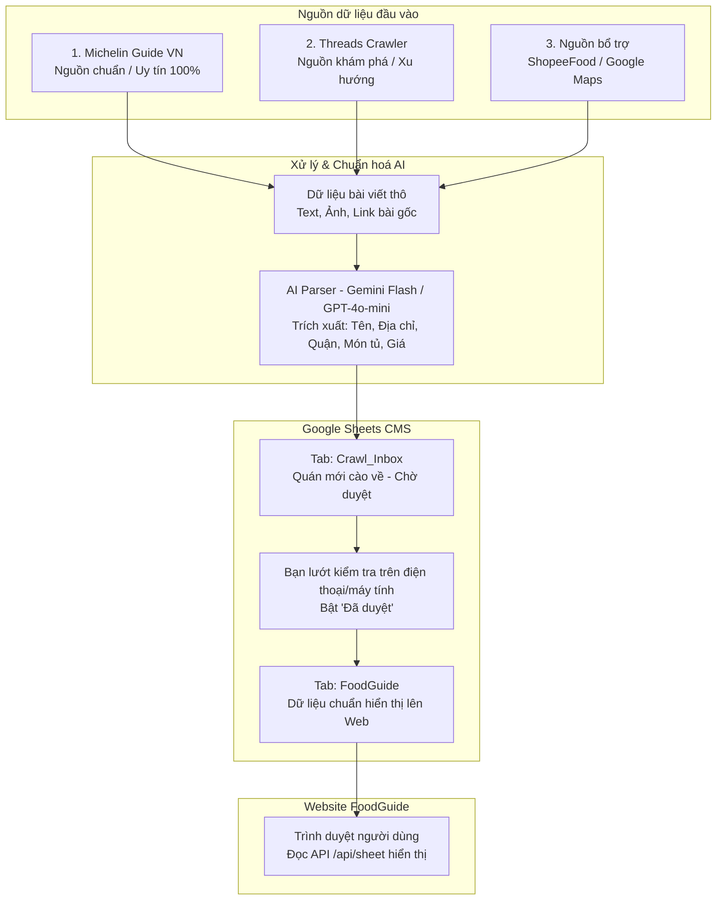

# KẾ HOẠCH & TÀI LIỆU HỆ THỐNG CRAWL DỮ LIỆU QUÁN ĂN (FOODGUIDE)

Tài liệu này ghi lại toàn bộ chiến lược, kiến trúc và quy trình 4 bước để tự động thu thập (crawl), làm sạch bằng AI và đồng bộ dữ liệu quán ăn, đồ uống từ mạng xã hội (Threads, ...) và các nguồn uy tín vào Google Sheets làm CMS cho trang web **FoodGuide**.

---

> **Cập nhật sau khi kiểm chứng & triển khai** — tài liệu gốc giữ nguyên bên dưới,
> nhưng bốn điểm sau đã được sửa khi làm thật. Xem [`crawler/README.md`](crawler/README.md).
>
> | Kế hoạch gốc | Thực tế |
> |---|---|
> | Michelin "HTML tĩnh, không bị chặn", dùng `requests` + BeautifulSoup | Sai. Trang có **AWS WAF** với thử thách JS — `curl` nhận HTTP 202, 0 link quán. Phải dùng Playwright, nên Bước 1 **không** nhanh hơn Bước 3. |
> | Bước 4 Cách 2: `POST /api/sheet` với `action: "push"` | Ghi thẳng vào tab **FoodGuide**, phá đúng cơ chế duyệt 2 tab. Đã thêm tham số `sheet` để đẩy vào `Crawl_Inbox`. |
> | `category`: `"Phở & Bún"`, `"Cà phê & Trà"` | App lọc theo **id** (`mon-soi`, `cafe-chill`). Ghi tên hiển thị thì quán biến mất khỏi bộ lọc. |
> | `priceLevel`: `$` / `$$` / `$$$` | App dùng `low` / `mid` / `high`. |
>
> Ba trường khác cũng đổi vì mâu thuẫn với nguyên tắc của chính dự án:
> `rating` **không** gán mặc định 4.2–5.0 (bịa số), `verified` **không** tự bật cho Michelin
> (nhãn đó nghĩa là bạn tự đối chiếu), `image` **không** hotlink ảnh bài viết
> (bản quyền, và link CDN hết hạn sau vài ngày).
>
> Prompt AI cũng sửa: trả về **mảng** (một bài có thể nhiều quán), **cấm suy đoán**,
> và dùng **structured output** thay vì bóc ```json bằng tay.

---


## 0. Hướng dẫn chạy

Phần này mô tả **bản đang chạy được**, không phải kế hoạch. Chi tiết kỹ thuật nằm ở [`crawler/README.md`](crawler/README.md).

### 0.1. Cài một lần

```bash
pip install -r crawler/requirements.txt
python -m playwright install chromium     # Michelin có AWS WAF, phải có trình duyệt thật

cp crawler/.env.example crawler/.env
```

Mở `crawler/.env` điền đúng một dòng bắt buộc:

```
FOODGUIDE_API=https://angihanoi.vercel.app
```

Thiếu `https://` hay dán nguyên `.../api/sheet` đều được — tool tự dọn.
`GEMINI_API_KEY` chỉ cần khi dùng lệnh `parse` (Bước 3), để trống vẫn cào Michelin bình thường.

**Kiểm tra Apps Script trước khi chạy lần đầu.** Bản cũ không hiểu tham số `sheet`,
và nó **không báo lỗi** — nó ghi thẳng vào tab `FoodGuide` rồi trả về `ok:true`.
Cách cập nhật: mở Google Sheet → *Tiện ích mở rộng* → *Apps Script* → dán đè toàn bộ
[`tools/sheet-appscript.gs`](tools/sheet-appscript.gs) → *Triển khai* → *Quản lý bản triển khai*
→ ✏️ sửa bản **đang dùng** → *Phiên bản: Mới* → *Triển khai*.

> Chọn "Bản triển khai **mới**" là ra URL khác và trang web mất kết nối. Phải sửa bản đang dùng.

### 0.2. Bốn bước chạy

```bash
# 1. Kiểm tra kết nối + phiên bản Apps Script. Không đụng dữ liệu, chạy lúc nào cũng an toàn.
python crawler/run.py check

# 2. Cào Michelin → lưu ra crawler/out/michelin.json. CHƯA đẩy đi đâu.
python crawler/run.py michelin

# 3. Mở file JSON xem, thấy ổn mới đẩy vào tab Crawl_Inbox.
python crawler/run.py push crawler/out/michelin.json
```

**4.** Trong Google Sheet: tab `Crawl_Inbox` → tick cột **Duyệt** ở những quán ưng ý
→ menu **🍜 FoodGuide → ✅ Duyệt các quán đã tick**. Chỉ những dòng được tick mới sang tab chính.

```bash
# 5. CHỈ SAU KHI đã duyệt: lấy địa chỉ cho những quán vừa vào cẩm nang
python crawler/run.py addresses
```

Bước 2 và 3 tách rời có chủ đích: cào xong không tự đẩy, để bạn nhìn dữ liệu trước.
Muốn gộp thì thêm `--push`.

Bước 5 tách khỏi bước 2 cũng có chủ đích, xem 0.6b. Cào chỉ mất **~30 giây**;
việc mở trang chi tiết lấy địa chỉ mới là phần lâu, và nó chỉ chạy cho số quán
bạn thật sự chọn. Thử trước cho chắc: `python crawler/run.py addresses --limit 5`.

### 0.3. Các cờ

| Cờ | Tác dụng |
|---|---|
| `--api https://...` | Đổi máy chủ tạm thời, khỏi sửa `.env` |
| `--show` | Hiện cửa sổ trình duyệt — dùng khi Michelin đổi giao diện và selector hỏng |
| `--push` | Cào xong đẩy luôn, bỏ qua bước xem file |
| `--details` | Lấy địa chỉ ngay trong lượt cào, thay vì để dành cho lệnh `addresses`. Chậm hơn nhiều |
| `--limit 5` | Của lệnh `addresses`: chỉ làm 5 quán, để thử trước |
| `--tab Crawl_Inbox` | Của lệnh `addresses`: làm ở phòng chờ thay vì tab chính |
| `CRAWL_MAX_PAGES=2` | Biến môi trường, giới hạn số trang mỗi thành phố |
| `CRAWL_DELAY=3.0` | Giây nghỉ giữa các trang. Đừng hạ xuống — cào chậm là cách rẻ nhất để không bị chặn |

### 0.4. `check` nói gì

Sẵn sàng:

```
Máy chủ : https://angihanoi.vercel.app/api/sheet
Tab đích: Crawl_Inbox
Apps Script: bản mới — hiểu tab Crawl_Inbox (147 dòng đang có trong đó)

✓ Sẵn sàng. Chạy:  python crawler/run.py michelin
```

Dòng `Apps Script:` là dòng quan trọng nhất — nó đi trọn vòng tới Google, khác với khối
JSON phía trên chỉ nói máy chủ Vercel đã có đủ biến môi trường chưa.

Chưa cập nhật Apps Script — **lệnh `push` sẽ từ chối ghi, không phải cào lại**:

```
✗ Cào được, nhưng CHƯA đẩy lên Sheet được:
  Apps Script trên Google đang là BẢN CŨ, chưa biết tab Crawl_Inbox.
  Bản cũ không báo lỗi — nó ghi hết vào tab chính.
```

### 0.5. Chạy lại nhiều lần có sao không

Không. `id` sinh từ tên quán và quận chứ không từ thời điểm cào, nên chạy lại 5 lần
vẫn ra đúng 143 dòng — Apps Script ghi đè theo `id` thay vì thêm mới. Việc điền thêm
địa chỉ cũng không làm đổi `id`, dù `id` bình thường có trộn quận — xem ghi chú
trong `to_michelin_place()`.
Cào lại sau vài tháng thì quán mới được thêm, quán cũ được cập nhật.

### 0.6. Ba thứ máy không tự điền

| | Vì sao |
|---|---|
| **Số sao & lượt đánh giá** | Michelin chấm Sao / Bib Gourmand / Selected, không phải thang 1–5. Quy đổi sang 4.6 là bịa. Hạng Michelin nằm ở cột Tags. |
| **Ảnh** | Ảnh Michelin có bản quyền; link CDN mạng xã hội hết hạn sau vài ngày. Dùng nút 📷 trong trang để tải ảnh bạn chụp. |
| **Quận** | Xem 0.6b — điền được phần lớn, nhưng không phải tất cả. |

Nhãn **Đã xác minh** cũng luôn tắt: nó có nghĩa là *bạn* đã tự đối chiếu Google Maps.

**Địa chỉ thì lấy được**, từ trang chi tiết của chính Michelin — xem mục tiếp theo.

### 0.6b. Địa chỉ và quận lấy từ đâu

Trang *danh sách* chỉ ghi "Hanoi, Vietnam", không có số nhà. Nhưng mỗi quán có
một *trang chi tiết*, và Michelin nhúng sẵn trong đó một khối **JSON-LD**:

```json
"address": { "@type": "PostalAddress",
  "streetAddress": "GF, Sofitel Legend Metropole, 15 Ngo Quyen Street, Hoan Kiem Ward",
  "addressLocality": "Hanoi" }
```

Đọc JSON-LD chứ không bóc theo class CSS — đó là dữ liệu có cấu trúc họ chủ động
công bố, không đổi mỗi lần thay giao diện. `robots.txt` không cấm đường
`/restaurant/...`, chỉ cấm URL có tham số lọc.

**Nhưng việc này để dành làm sau, không làm lúc cào.** Địa chỉ chỉ dùng để xếp
quán vào đúng bộ lọc quận, mà bộ lọc chỉ có nghĩa với quán đã nằm trong cẩm nang.
Cào 141 quán rồi mở luôn 141 trang chi tiết nghĩa là tải địa chỉ của hàng trăm
quán bạn sẽ không bao giờ chọn — mất 9 phút và làm phiền máy chủ người ta vô ích.

Nên lượt cào chỉ lưu lại **bảng link** (`crawler/out/michelin_links.json`), và
`run.py addresses` mới đi lấy địa chỉ — chỉ cho quán đã ở trong cẩm nang mà còn
thiếu ô địa chỉ. Nó đọc cả dòng về, sửa đúng hai ô `address`/`district` rồi đẩy
lại, nên thứ bạn đã sửa tay không bị mất. Quận đã điền sẵn thì nó không đụng.

Đo thực tế: cào 141 quán mất **27 giây**; `addresses` cho 5 quán mất chưa tới
một phút. Chạy `addresses` nhiều lần cũng không sao — nó bỏ qua quán đã có địa chỉ.

Quận thì suy ra từ địa chỉ, và **chỉ suy khi chắc chắn**. Từ 2025 Hà Nội bỏ quận,
chuyển sang phường: tên nào trùng quận cũ (`Hoan Kiem Ward`, `Ba Dinh Ward`) thì
nhận ra được, còn phường mới như `Cua Nam` thì để trống — Cửa Nam nay gộp từ
nhiều quận cũ, đoán bừa là đẩy quán vào nhầm bộ lọc.

Bảng quận dùng để so khớp nằm ở `HANOI_DISTRICTS` trong `crawler/config.py`.
Bộ lọc trên trang thì đọc `DISTRICTS` trong `js/data.js` — hiện chỉ có 7 quận,
nên quận ngoài 7 cái đó vẫn hiện ở "Tất cả" nhưng không lọc riêng được.

Quán ở TP.HCM đương nhiên không có quận Hà Nội. Nếu cẩm nang chỉ làm Hà Nội,
bỏ dòng `ho-chi-minh` trong `MICHELIN_START_URLS` là cào nhanh hơn hẳn.

### 0.7. Gặp lỗi thì làm gì

| Hiện tượng | Nguyên nhân & cách xử lý |
|---|---|
| `HTTP Error 504` giữa chừng | Vercel bỏ cuộc chờ sau 60 giây, **Apps Script vẫn đang ghi**. Lệnh tự thử lại và tự đếm lại số dòng ở cuối, cứ đọc dòng "Đếm lại trên Sheet". |
| `... 120 mới, 27 cập nhật` | Lô bị 504 rồi gửi lại: ghi một lần, đếm hai lần. Cộng lại đủ số quán là không mất gì. |
| Tab `Crawl_Inbox` trông trống dù đã đẩy | Bản Apps Script cũ rải sẵn 1000 ô tick, làm dữ liệu bị nối xuống dòng 1001. Cập nhật script rồi chạy menu **🍜 FoodGuide → 🧹 Dọn dòng trống**. |
| `UnicodeEncodeError ... cp1252` | Console Windows. Đã ép UTF-8 trong `run.py`, nếu vẫn gặp thì đặt `PYTHONIOENCODING=utf-8`. |
| Cào ra 0 quán | Michelin đổi giao diện. Chạy `python crawler/run.py michelin --show` để xem trình duyệt và chỉnh lại selector trong `read_cards()` của `crawler/michelin.py`. |
| `Bỏ N quán ngoài Việt Nam` | Bình thường, không phải lỗi. Trang danh sách Việt Nam có lẫn quán nước khác (đã gặp 4 quán Chengdu). Tool loại chúng và **in tên ra** để bạn kiểm lại, chứ không loại âm thầm. |

Nếu Michelin chặn thật (mở tay được mà tool không được) thì **dừng lại**. Không thêm plugin
giấu dấu vết, không xoay proxy, không giải captcha — đó là họ từ chối.

### 0.8. Cấu trúc thư mục thật

Mục 4 bên dưới là bố cục *dự kiến*. Khi làm thật thì gộp phẳng lại cho dễ đọc:

```
crawler/
├── run.py            # CLI: check / michelin / parse / push
├── config.py         # đọc .env, chuẩn hoá địa chỉ máy chủ
├── schema.py         # nguồn sự thật của dữ liệu — 3 quy tắc ở mục 0.6
├── michelin.py       # Bước 1, Playwright
├── ai_parser.py      # Bước 3, Gemini structured output
├── push_to_sheet.py  # Bước 4, đẩy qua /api/sheet + dò phiên bản Apps Script
└── out/              # kết quả cào, không commit
```

Bước 2 (Threads) chưa làm, xem lý do ở cuối [`crawler/README.md`](crawler/README.md).

---

## 1. Tổng quan kiến trúc hệ thống



---

## 2. Quy trình 4 bước thực hiện chi tiết

### BƯỚC 1: Xây dựng dữ liệu nền tảng (Core / Verified) — Michelin Guide Vietnam

* **Mục tiêu**: Có ngay tập dữ liệu ~150–300 quán ăn/uống đỉnh cao tại Hà Nội, TP.HCM, Đà Nẵng với thông tin chuẩn xác 100% (tên, địa chỉ, ảnh đẹp, phân hạng Michelin Selected, Bib Gourmand, Michelin Star).
* **Nguồn**: `https://guide.michelin.com/vn/vi/restaurants`
* **Công nghệ**: Python (`requests` / `httpx`, `BeautifulSoup4`).
* **Đặc tính**: Web render HTML tĩnh, dễ crawl, không bị chặn, cấu trúc thẻ rõ ràng.
* **Quy ước dữ liệu**:
  * `verified`: `true`
  * `dataSource`: `"michelin"`
  * `rating`: Điểm sao Michelin hoặc đặt mặc định 4.2 - 5.0.

---

### BƯỚC 2: Tool khám phá xu hướng (Discovery) — Threads Crawler

* **Mục tiêu**: Cào các bài chia sẻ "quán ruột", "quán ngon giấu kín" từ người dùng thật trên mạng xã hội Threads (văn phong tự nhiên, ít quảng cáo ảo hơn TikTok).
* **Nguồn**: `https://www.threads.net/search?q=...`
* **Từ khóa mục tiêu**:
  * `"quán ruột hà nội"`, `"quán ruột sài gòn"`
  * `"quán ngon phải thử"`, `"must try ăn uống"`
  * `#reviewanngon`, `#hanoifood`, `#saigonfood`
* **Công nghệ**:
  * Python + **Playwright** (chạy headless browser).
  * Lắng nghe và chặn bắt (intercept) dữ liệu từ GraphQL API của Threads (`threads.net/api/graphql`) khi cuộn trang, thu về JSON có: text bài viết, link ảnh, số like, tác giả và link bài post.
* **Xử lý chống chặn bot**:
  * Đặt thời gian nghỉ ngẫu nhiên giữa các lần cuộn (2s - 5s).
  * Giả lập User-Agent trình duyệt thật.

---

### BƯỚC 3: Tầng làm sạch & Trích xuất có cấu trúc bằng AI (AI Parser)

Bài viết trên Threads là văn bản tự do, lộn xộn. Cần đưa qua AI để trích xuất thành định dạng bảng chuẩn.

* **Công nghệ**: **Gemini 2.0 Flash / 1.5 Flash** (hoặc GPT-4o-mini) — chi phí cực rẻ (hoặc miễn phí theo hạn mức hàng ngày của Google AI Studio).
* **Prompt chuẩn hoá**:
  ```text
  Bạn là trợ lý dữ liệu ẩm thực cho FoodGuide.
  Đọc bài viết review sau và trích xuất thông tin quán ăn/đồ uống thành JSON.
  Nếu không có thông tin thì để chuỗi rỗng "".

  Cấu trúc JSON yêu cầu:
  {
    "name": "Tên quán",
    "category": "Phở & Bún | Cơm & Xôi | Đồ nướng & Lẩu | Cà phê & Trà | Ăn vặt | Khác",
    "district": "Tên quận (ví dụ: Hoàn Kiếm, Cầu Giấy, Quận 1...)",
    "address": "Địa chỉ chi tiết nếu có",
    "priceRange": "Khoảng giá ước tính (ví dụ: 35k - 60k)",
    "mustTry": "Món nên gọi nhất theo bài review",
    "review": "Tóm tắt ngắn gọn cảm nhận (dưới 2 câu)",
    "tags": "Từ khoá cách nhau bởi dấu phẩy, ví dụ: vỉa hè, mở đêm, điều hoà"
  }
  ```

---

### BƯỚC 4: Đồng bộ vào Google Sheet & Quy trình kiểm duyệt (Curation)

* **Phương thức đẩy dữ liệu**:
  * **Cách 1 (Khuyên dùng)**: Dùng **Google Sheets API (Service Account)** thông qua thư viện Python `gspread` để đẩy hàng loạt vào tab `Crawl_Inbox`.
  * **Cách 2**: Gửi HTTP POST trực tiếp đến API `/api/sheet` của trang web với `action: "push"`.
* **Cơ chế kiểm duyệt 2 tab trong Google Sheet**:
  1. **Tab `Crawl_Inbox`**: Nơi các script cào đổ dữ liệu về. Có thêm cột `Trạng thái` (`Chờ duyệt`, `Bỏ qua`).
  2. **Tab `FoodGuide`**: Tab chính thức đang kết nối với trang web.
  3. **Thao tác của bạn**: Thỉnh thoảng mở app Google Sheets trên điện thoại hoặc máy tính, đọc nhanh danh sách bài cào về, chọn các quán chất lượng và duyệt sang tab chính thức.

---

## 3. Bảng ánh xạ cấu trúc dữ liệu (Data Schema)

Để tương thích 100% với hệ thống [tools/sheet-appscript.gs](tools/sheet-appscript.gs) hiện tại, mỗi quán crawl được cần chuẩn hóa theo các cột sau:

| Tên cột trong Sheet        | Key JSON        | Kiểu dữ liệu | Ý nghĩa & Ví dụ                                                            |
| :--------------------------- | :-------------- | :-------------- | :----------------------------------------------------------------------------- |
| **ID**                 | `id`          | string          | Mã duy nhất (ví dụ:`michelin-pho-10-ly-quoc-su`, `threads-post-12345`) |
| **Tên quán**         | `name`        | string          | Tên quán ăn                                                                 |
| **Danh mục**          | `category`    | string          | `Phở & Bún`, `Cà phê`, `Ăn vặt`, `Đồ nướng & Lẩu`...        |
| **Quận**              | `district`    | string          | `Hoàn Kiếm`, `Ba Đình`, `Quận 1`...                                 |
| **Địa chỉ**         | `address`     | string          | Số nhà, ngõ, tên đường                                                  |
| **Số sao**            | `rating`      | number          | Ví dụ:`4.5` (mặc định 4.0 - 5.0)                                        |
| **Lượt đánh giá** | `reviewCount` | number          | Lượt tương thích / like bài viết                                        |
| **Khoảng giá**       | `priceRange`  | string          | Ví dụ:`30.000đ - 70.000đ`                                                |
| **Mức giá**          | `priceLevel`  | string          | `$` (bình dân), `$$` (vừa phải), `$$$` (cao cấp)                    |
| **Giờ mở cửa**      | `time`        | string          | Ví dụ:`07:00 - 22:00`                                                      |
| **Món must-try**      | `mustTry`     | string          | Tên món nên gọi nhất                                                      |
| **Cảm nhận**         | `review`      | string          | Nhận xét tóm tắt của bài review                                          |
| **Link Google Maps**   | `mapsUrl`     | string          | Link Google Maps quán (nếu tìm được)                                     |
| **Tags**               | `tags`        | string          | Cách nhau bằng dấu phẩy                                                    |
| **Ảnh**               | `image`       | string          | URL ảnh bài viết                                                            |
| **Vĩ độ**           | `lat`         | number          | Tọa độ latitude                                                             |
| **Kinh độ**          | `lng`         | number          | Tọa độ longitude                                                            |
| **Đã xác minh**     | `verified`    | boolean         | `true` (Michelin / Đã ăn thử) hoặc `false`                            |
| **Nổi bật**          | `featured`    | boolean         | `true` hoặc `false`                                                       |
| **Nguồn dữ liệu**   | `dataSource`  | string          | `"michelin"`, `"threads"`, `"tiktok"`, `"manual"`                      |
| **Cập nhật lúc**    | `updatedAt`   | string          | ISO Timestamp (ví dụ:`2026-09-03T15:00:00.000Z`)                           |

---

## 4. Cấu trúc thư mục dự kiến cho Tool Crawl

Tạo một thư mục `crawler/` trong dự án:

```
foodguide/
├── crawler/
│   ├── requirements.txt         # playwright, beautifulsoup4, gspread, google-genai
│   ├── config.py                # Cấu hình API keys, Google Sheet ID, search keywords
│   ├── extractors/
│   │   ├── michelin_crawler.py  # Script cào Michelin Guide VN (Bước 1)
│   │   └── threads_crawler.py   # Script cào Threads (Bước 2)
│   ├── processors/
│   │   └── ai_parser.py         # Module gọi Gemini Flash trích xuất JSON (Bước 3)
│   └── sync/
│       └── sheet_sync.py        # Module đẩy dữ liệu vào Google Sheets (Bước 4)
├── api/                         # Backend Vercel Serverless có sẵn
├── tools/                       # sheet-appscript.gs có sẵn
└── crawl.md                     # Tài liệu này
```

---

## 5. Kế hoạch triển khai tiếp theo

1. **Giai đoạn 1**: Viết script `michelin_crawler.py` để lấy toàn bộ danh sách quán Michelin tại Hà Nội & TP.HCM nạp vào Sheet trước. (Hoàn thành nhanh, có ngay dữ liệu xịn).
2. **Giai đoạn 2**: Tạo tài khoản Google AI Studio lấy API Key miễn phí cho **Gemini Flash**, viết module `ai_parser.py`.
3. **Giai đoạn 3**: Viết script `threads_crawler.py` bằng Playwright để cào bài viết tự động theo từ khoá.
4. **Giai đoạn 4**: Ghép nối pipeline hoàn chỉnh và thiết lập chạy định kỳ.
