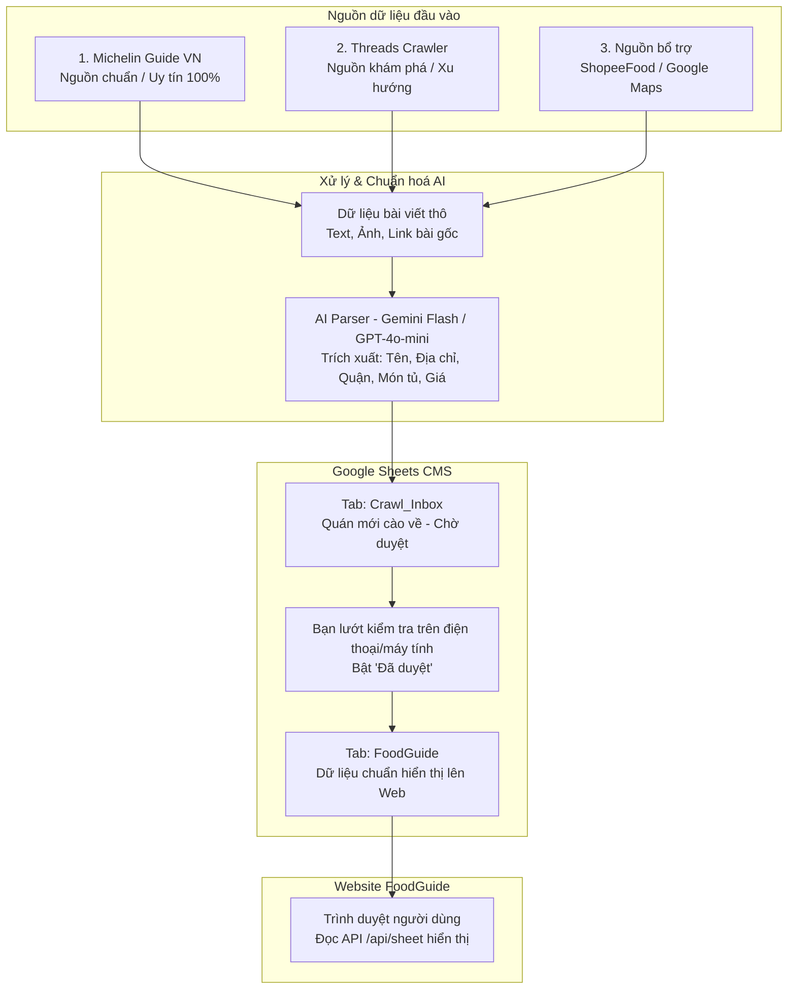

# KẾ HOẠCH & TÀI LIỆU HỆ THỐNG CRAWL DỮ LIỆU QUÁN ĂN (FOODGUIDE)

Tài liệu này ghi lại toàn bộ chiến lược, kiến trúc và quy trình 4 bước để tự động thu thập (crawl), làm sạch bằng AI và đồng bộ dữ liệu quán ăn, đồ uống từ mạng xã hội (Threads, ...) và các nguồn uy tín vào Google Sheets làm CMS cho trang web **FoodGuide**.

---

## 1. Tổng quan kiến trúc hệ thống



---

## 2. Quy trình 4 bước thực hiện chi tiết

### BƯỚC 1: Xây dựng dữ liệu nền tảng (Core / Verified) — Michelin Guide Vietnam

* **Mục tiêu**: Có ngay tập dữ liệu ~150–300 quán ăn/uống đỉnh cao tại Hà Nội, TP.HCM, Đà Nẵng với thông tin chuẩn xác 100% (tên, địa chỉ, ảnh đẹp, phân hạng Michelin Selected, Bib Gourmand, Michelin Star).
* **Nguồn**: `https://guide.michelin.com/vn/vi/restaurants`
* **Công nghệ**: Python (`requests` / `httpx`, `BeautifulSoup4`).
* **Đặc tính**: Web render HTML tĩnh, dễ crawl, không bị chặn, cấu trúc thẻ rõ ràng.
* **Quy ước dữ liệu**:
  * `verified`: `true`
  * `dataSource`: `"michelin"`
  * `rating`: Điểm sao Michelin hoặc đặt mặc định 4.2 - 5.0.

---

### BƯỚC 2: Tool khám phá xu hướng (Discovery) — Threads Crawler

* **Mục tiêu**: Cào các bài chia sẻ "quán ruột", "quán ngon giấu kín" từ người dùng thật trên mạng xã hội Threads (văn phong tự nhiên, ít quảng cáo ảo hơn TikTok).
* **Nguồn**: `https://www.threads.net/search?q=...`
* **Từ khóa mục tiêu**:
  * `"quán ruột hà nội"`, `"quán ruột sài gòn"`
  * `"quán ngon phải thử"`, `"must try ăn uống"`
  * `#reviewanngon`, `#hanoifood`, `#saigonfood`
* **Công nghệ**:
  * Python + **Playwright** (chạy headless browser).
  * Lắng nghe và chặn bắt (intercept) dữ liệu từ GraphQL API của Threads (`threads.net/api/graphql`) khi cuộn trang, thu về JSON có: text bài viết, link ảnh, số like, tác giả và link bài post.
* **Xử lý chống chặn bot**:
  * Đặt thời gian nghỉ ngẫu nhiên giữa các lần cuộn (2s - 5s).
  * Giả lập User-Agent trình duyệt thật.

---

### BƯỚC 3: Tầng làm sạch & Trích xuất có cấu trúc bằng AI (AI Parser)

Bài viết trên Threads là văn bản tự do, lộn xộn. Cần đưa qua AI để trích xuất thành định dạng bảng chuẩn.

* **Công nghệ**: **Gemini 2.0 Flash / 1.5 Flash** (hoặc GPT-4o-mini) — chi phí cực rẻ (hoặc miễn phí theo hạn mức hàng ngày của Google AI Studio).
* **Prompt chuẩn hoá**:
  ```text
  Bạn là trợ lý dữ liệu ẩm thực cho FoodGuide.
  Đọc bài viết review sau và trích xuất thông tin quán ăn/đồ uống thành JSON.
  Nếu không có thông tin thì để chuỗi rỗng "".

  Cấu trúc JSON yêu cầu:
  {
    "name": "Tên quán",
    "category": "Phở & Bún | Cơm & Xôi | Đồ nướng & Lẩu | Cà phê & Trà | Ăn vặt | Khác",
    "district": "Tên quận (ví dụ: Hoàn Kiếm, Cầu Giấy, Quận 1...)",
    "address": "Địa chỉ chi tiết nếu có",
    "priceRange": "Khoảng giá ước tính (ví dụ: 35k - 60k)",
    "mustTry": "Món nên gọi nhất theo bài review",
    "review": "Tóm tắt ngắn gọn cảm nhận (dưới 2 câu)",
    "tags": "Từ khoá cách nhau bởi dấu phẩy, ví dụ: vỉa hè, mở đêm, điều hoà"
  }
  ```

---

### BƯỚC 4: Đồng bộ vào Google Sheet & Quy trình kiểm duyệt (Curation)

* **Phương thức đẩy dữ liệu**:
  * **Cách 1 (Khuyên dùng)**: Dùng **Google Sheets API (Service Account)** thông qua thư viện Python `gspread` để đẩy hàng loạt vào tab `Crawl_Inbox`.
  * **Cách 2**: Gửi HTTP POST trực tiếp đến API `/api/sheet` của trang web với `action: "push"`.
* **Cơ chế kiểm duyệt 2 tab trong Google Sheet**:
  1. **Tab `Crawl_Inbox`**: Nơi các script cào đổ dữ liệu về. Có thêm cột `Trạng thái` (`Chờ duyệt`, `Bỏ qua`).
  2. **Tab `FoodGuide`**: Tab chính thức đang kết nối với trang web.
  3. **Thao tác của bạn**: Thỉnh thoảng mở app Google Sheets trên điện thoại hoặc máy tính, đọc nhanh danh sách bài cào về, chọn các quán chất lượng và duyệt sang tab chính thức.

---

## 3. Bảng ánh xạ cấu trúc dữ liệu (Data Schema)

Để tương thích 100% với hệ thống [tools/sheet-appscript.gs](file:///d:/1.tangocduc/Code/foodguide/tools/sheet-appscript.gs) hiện tại, mỗi quán crawl được cần chuẩn hóa theo các cột sau:

| Tên cột trong Sheet        | Key JSON        | Kiểu dữ liệu | Ý nghĩa & Ví dụ                                                            |
| :--------------------------- | :-------------- | :-------------- | :----------------------------------------------------------------------------- |
| **ID**                 | `id`          | string          | Mã duy nhất (ví dụ:`michelin-pho-10-ly-quoc-su`, `threads-post-12345`) |
| **Tên quán**         | `name`        | string          | Tên quán ăn                                                                 |
| **Danh mục**          | `category`    | string          | `Phở & Bún`, `Cà phê`, `Ăn vặt`, `Đồ nướng & Lẩu`...        |
| **Quận**              | `district`    | string          | `Hoàn Kiếm`, `Ba Đình`, `Quận 1`...                                 |
| **Địa chỉ**         | `address`     | string          | Số nhà, ngõ, tên đường                                                  |
| **Số sao**            | `rating`      | number          | Ví dụ:`4.5` (mặc định 4.0 - 5.0)                                        |
| **Lượt đánh giá** | `reviewCount` | number          | Lượt tương thích / like bài viết                                        |
| **Khoảng giá**       | `priceRange`  | string          | Ví dụ:`30.000đ - 70.000đ`                                                |
| **Mức giá**          | `priceLevel`  | string          | `$` (bình dân), `$$` (vừa phải), `$$$` (cao cấp)                    |
| **Giờ mở cửa**      | `time`        | string          | Ví dụ:`07:00 - 22:00`                                                      |
| **Món must-try**      | `mustTry`     | string          | Tên món nên gọi nhất                                                      |
| **Cảm nhận**         | `review`      | string          | Nhận xét tóm tắt của bài review                                          |
| **Link Google Maps**   | `mapsUrl`     | string          | Link Google Maps quán (nếu tìm được)                                     |
| **Tags**               | `tags`        | string          | Cách nhau bằng dấu phẩy                                                    |
| **Ảnh**               | `image`       | string          | URL ảnh bài viết                                                            |
| **Vĩ độ**           | `lat`         | number          | Tọa độ latitude                                                             |
| **Kinh độ**          | `lng`         | number          | Tọa độ longitude                                                            |
| **Đã xác minh**     | `verified`    | boolean         | `true` (Michelin / Đã ăn thử) hoặc `false`                            |
| **Nổi bật**          | `featured`    | boolean         | `true` hoặc `false`                                                       |
| **Nguồn dữ liệu**   | `dataSource`  | string          | `"michelin"`, `"threads"`, `"tiktok"`, `"manual"`                      |
| **Cập nhật lúc**    | `updatedAt`   | string          | ISO Timestamp (ví dụ:`2026-09-03T15:00:00.000Z`)                           |

---

## 4. Cấu trúc thư mục dự kiến cho Tool Crawl

Tạo một thư mục `crawler/` trong dự án:

```
foodguide/
├── crawler/
│   ├── requirements.txt         # playwright, beautifulsoup4, gspread, google-genai
│   ├── config.py                # Cấu hình API keys, Google Sheet ID, search keywords
│   ├── extractors/
│   │   ├── michelin_crawler.py  # Script cào Michelin Guide VN (Bước 1)
│   │   └── threads_crawler.py   # Script cào Threads (Bước 2)
│   ├── processors/
│   │   └── ai_parser.py         # Module gọi Gemini Flash trích xuất JSON (Bước 3)
│   └── sync/
│       └── sheet_sync.py        # Module đẩy dữ liệu vào Google Sheets (Bước 4)
├── api/                         # Backend Vercel Serverless có sẵn
├── tools/                       # sheet-appscript.gs có sẵn
└── crawl.md                     # Tài liệu này
```

---

## 5. Kế hoạch triển khai tiếp theo

1. **Giai đoạn 1**: Viết script `michelin_crawler.py` để lấy toàn bộ danh sách quán Michelin tại Hà Nội & TP.HCM nạp vào Sheet trước. (Hoàn thành nhanh, có ngay dữ liệu xịn).
2. **Giai đoạn 2**: Tạo tài khoản Google AI Studio lấy API Key miễn phí cho **Gemini Flash**, viết module `ai_parser.py`.
3. **Giai đoạn 3**: Viết script `threads_crawler.py` bằng Playwright để cào bài viết tự động theo từ khoá.
4. **Giai đoạn 4**: Ghép nối pipeline hoàn chỉnh và thiết lập chạy định kỳ.
